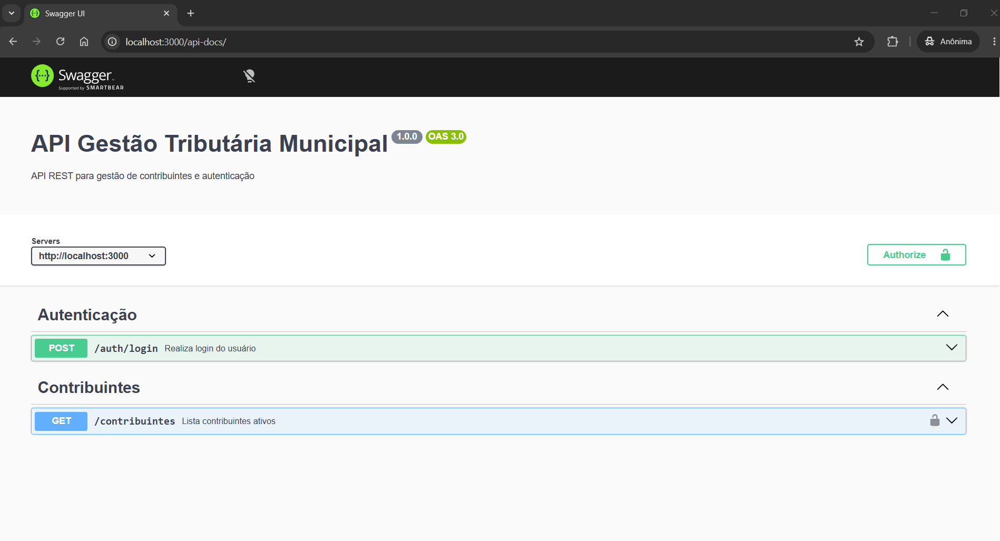
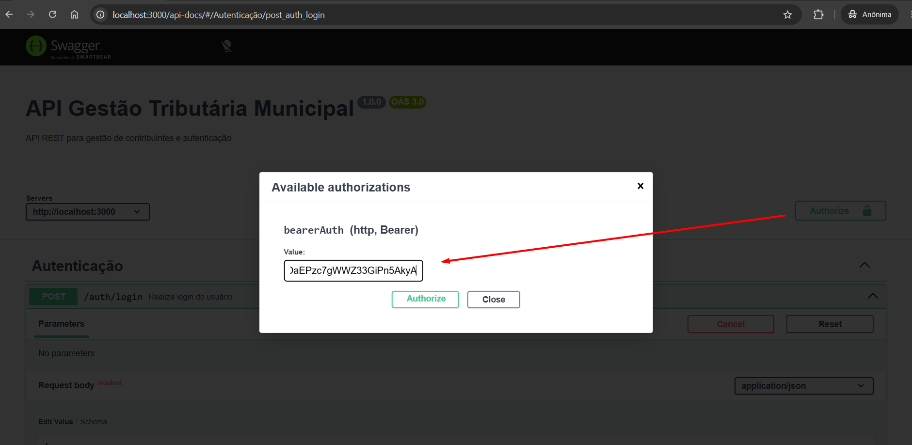
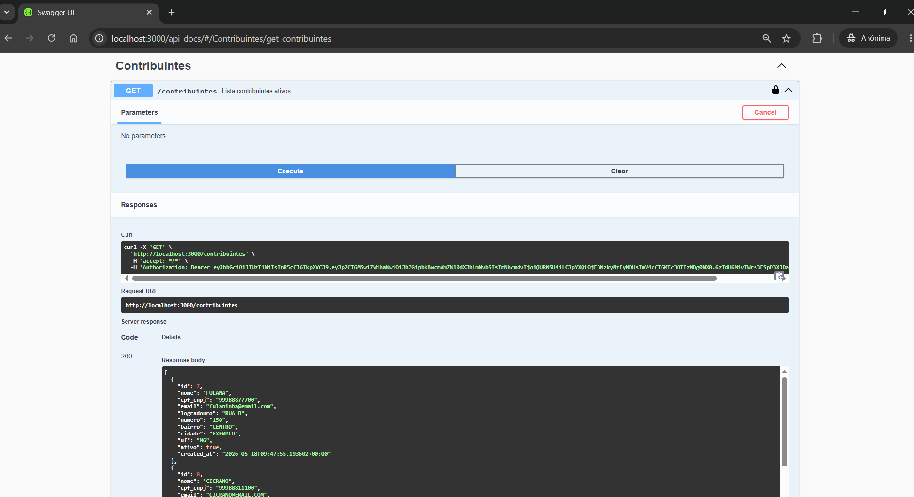

# API Gestão Tributária Municipal

API REST desenvolvida para estudos práticos de backend voltados à gestão tributária municipal.

O projeto foi criado com foco em aprendizado real de desenvolvimento backend utilizando Node.js, PostgreSQL e autenticação JWT, simulando funcionalidades comuns em sistemas públicos e corporativos.

---

## Tecnologias Utilizadas

* Node.js
* Express
* PostgreSQL
* Supabase
* JWT (JSON Web Token)
* Bcrypt
* Swagger
* Thunder Client / Postman

---

## Funcionalidades Implementadas

### Contribuintes

* Cadastro de contribuintes
* Listagem de contribuintes ativos
* Busca por ID
* Atualização de cadastro
* Exclusão lógica (`ativo = false`)
* Paginação de resultados

### Autenticação

* Login com JWT
* Middleware de autenticação
* Proteção de rotas
* Controle de acesso por cargo (ADMIN)

### Documentação

* Swagger/OpenAPI
* Testes integrados via Swagger UI

---

## Estrutura do Projeto

```bash id="k8m3rx"
src/
├── config/
├── middleware/
├── routes/
├── services/
```

---

## Instalação

```bash id="z4n7qp"
git clone https://github.com/williamaquino92/api-gestao-tributaria-municipal.git
```

```bash id="x2v9lt"
cd api-gestao-tributaria-municipal
```

```bash id="u6r1mw"
npm install
```

---

## Variáveis de Ambiente

Crie um arquivo `.env` na raiz do projeto:

```env id="p9w2ka"
SUPABASE_URL=sua_url
SUPABASE_KEY=sua_key
JWT_SECRET=sua_chave_jwt
```

---

## Executando o Projeto

```bash id="c5t8yn"
npm run dev
```

Servidor:

```txt id="d7m4qp"
http://localhost:3000
```

---

## Documentação Swagger

```txt id="f1x6rv"
http://localhost:3000/api-docs
```

---

## Exemplo de Login

### POST `/auth/login`

```json id="h3q9zb"
{
  "email": "admin@prefeitura.com",
  "senha": "123"
}
```

---

## Autenticação Bearer

Adicionar no Header:

```txt id="j8v2nc"
Authorization: Bearer SEU_TOKEN
```

---

## Aprendizados do Projeto

Durante o desenvolvimento foram praticados conceitos importantes de backend:

* APIs REST
* Estruturação de rotas
* Middleware
* JWT
* Hash de senha
* Controle de acesso
* Integração com PostgreSQL
* Debugging
* Git e GitHub
* Documentação de APIs

---

## Próximos Passos

* Deploy da API
* Frontend integrado
* Docker
* Logs de auditoria
* Refresh Token
* CI/CD

---

## Swagger



---

## Login



---

## GET Contribuintes



## Autor

William Aquino

LinkedIn:
https://www.linkedin.com/in/williamaquino92/
